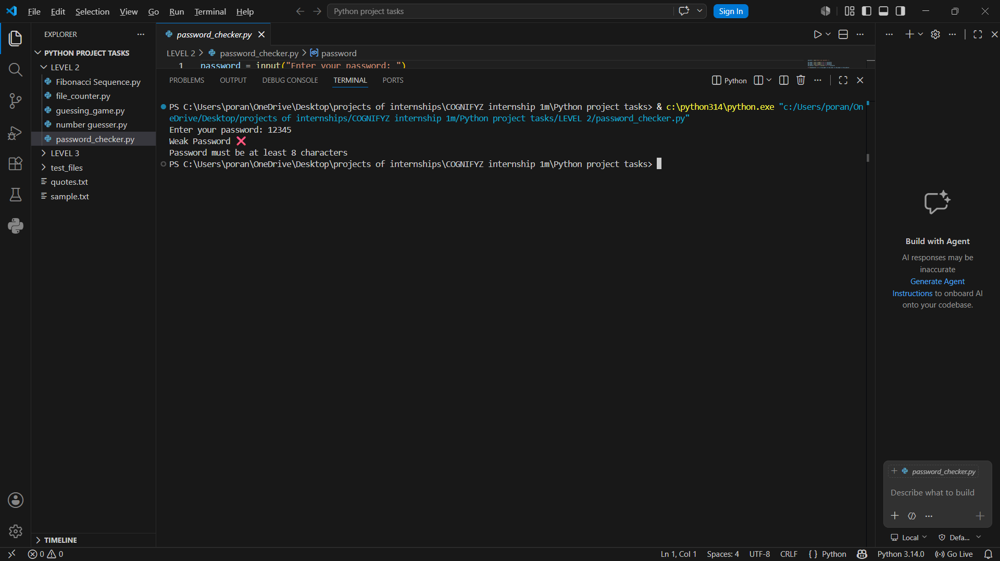

# Password Strength Checker

## Overview
A Python-based password strength checker that validates password security using multiple security rules.

---

## Features
- Checks password strength
- Detects weak passwords
- Validates secure password patterns
- Beginner-friendly cybersecurity project

---

## Technologies Used
- Python

---

## Screenshots

### Weak Password Detection

### Strong Password Validation

